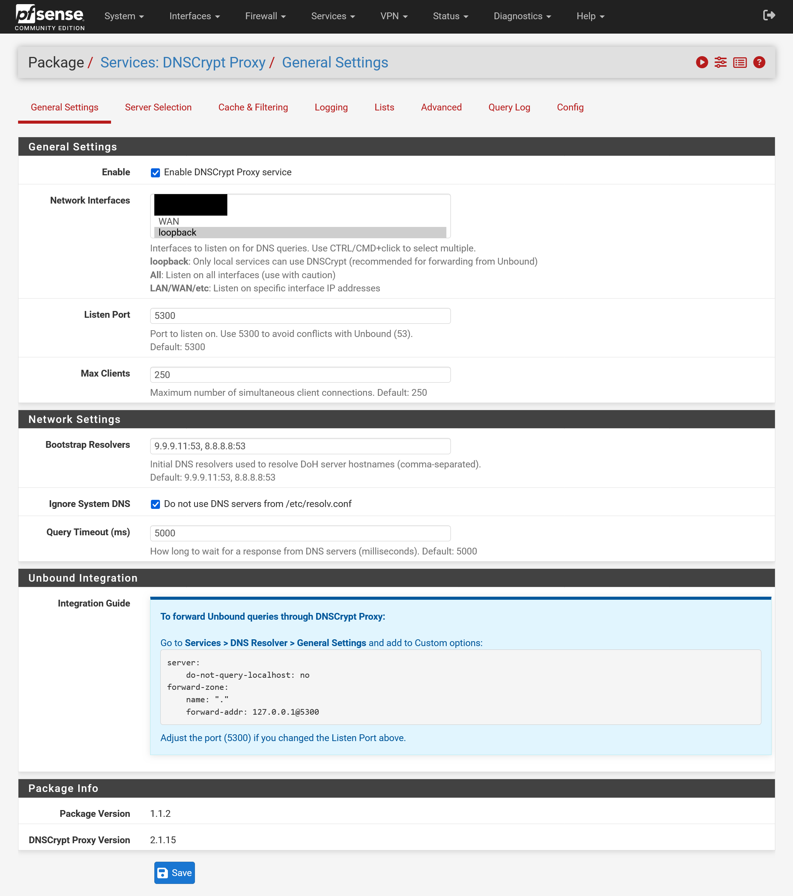
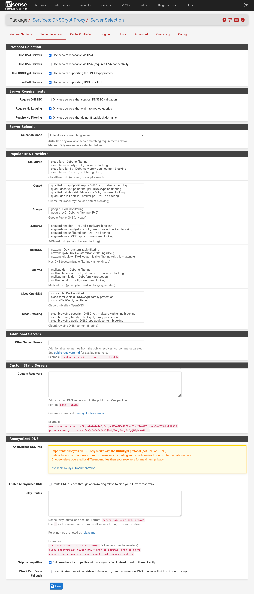
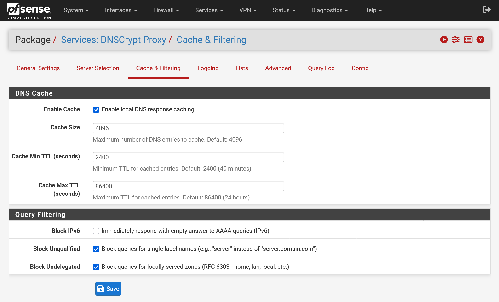
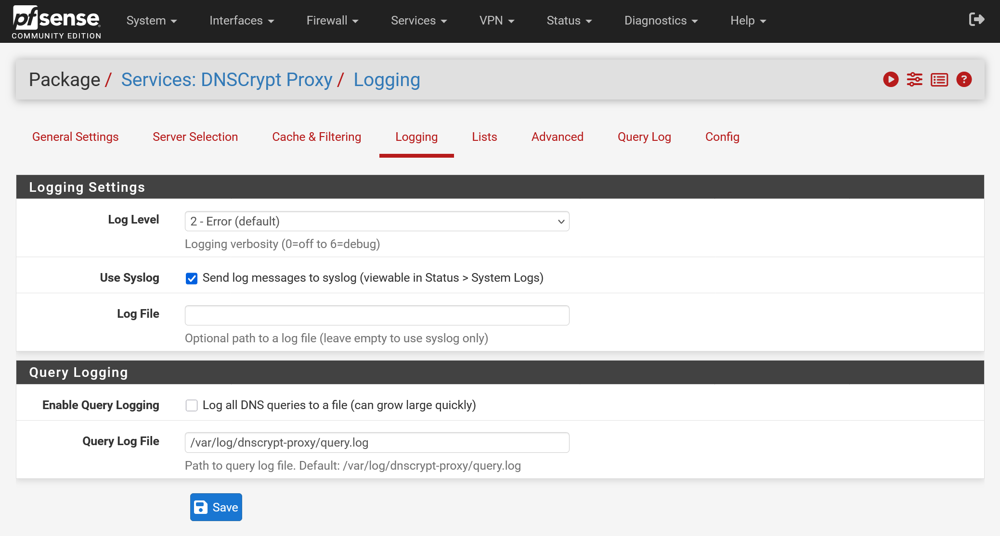
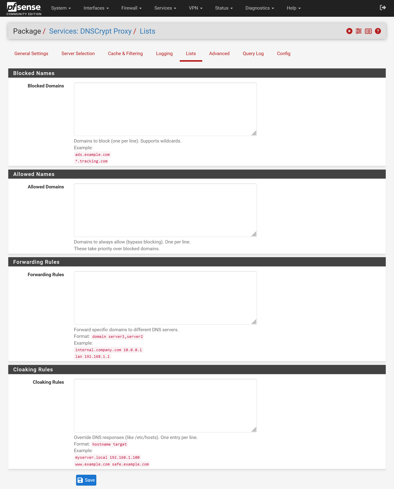
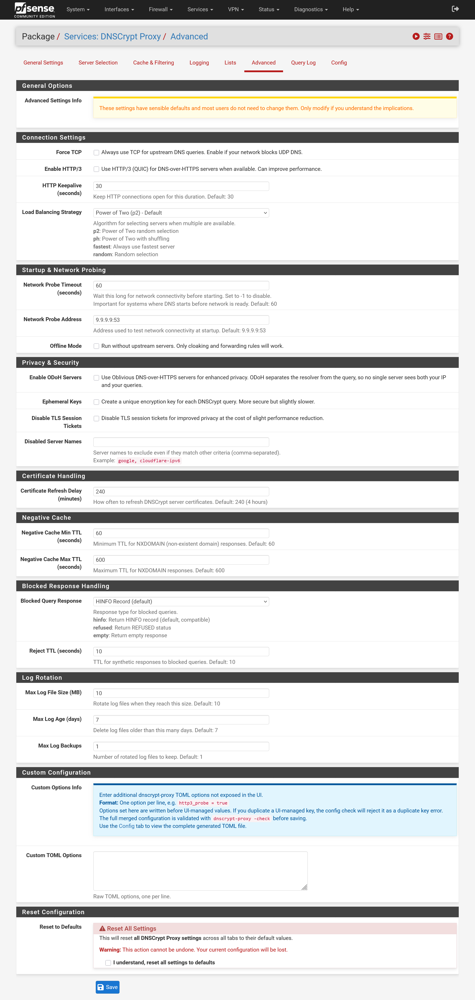
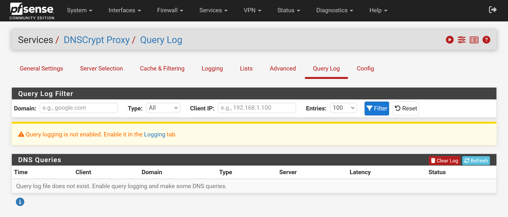
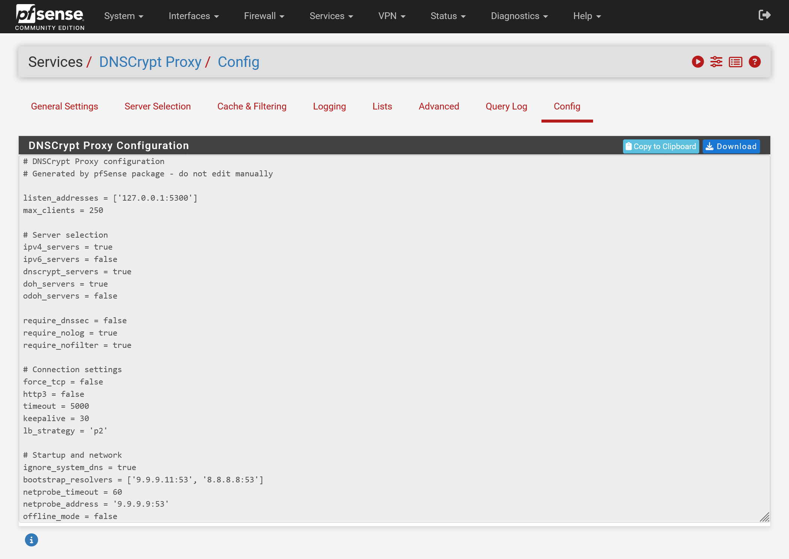

# pfSense DNSCrypt Proxy Package

[](https://github.com/nopoz/pfsense-dnscrypt-proxy/actions/workflows/ci.yml)
[](https://github.com/nopoz/pfsense-dnscrypt-proxy/releases/latest)
[](SECURITY.md#verifying-a-download)
[](LICENSE)

A pfSense package providing a full GUI for [DNSCrypt Proxy](https://github.com/DNSCrypt/dnscrypt-proxy), an encrypted DNS client supporting DNSCrypt v2, DNS-over-HTTPS (DoH), Oblivious DoH (ODoH), and Anonymized DNS protocols.

> **Note:** This is a community-maintained package and is not affiliated with or supported by Netgate.

## Features

- **Full GUI Configuration** - 8 configuration tabs accessible from the pfSense web interface
- **Multiple Protocols** - Supports DNSCrypt v2, DNS-over-HTTPS (DoH), Oblivious DoH (ODoH), and Anonymized DNS with relay routing
- **Popular Providers** - Pre-configured servers from Cloudflare, Quad9, Google, AdGuard, NextDNS, Mullvad, OpenDNS, CleanBrowsing, and more
- **Custom Resolvers** - Add custom servers via DNS stamps
- **Custom TOML Options** - Add any dnscrypt-proxy option not exposed in the UI, including TOML section blocks, with validation via `dnscrypt-proxy -check` before saving
- **Domain Filtering** - Block and allow lists, forwarding rules, and cloaking rules
- **Query Logging** - Built-in query log viewer with filtering by domain, type, and client IP
- **Config Management** - View, copy, download, import (paste or upload), and reset the TOML configuration
- **Advanced Tuning** - Load balancing strategies, HTTP/3 (QUIC) support, ephemeral keys, cache size/TTL controls, and log rotation
- **Multi-Architecture** - Supports both amd64 and arm64 (auto-detected)
- **Service Integration** - Managed via Status > Services like native pfSense services

## Screenshots

<details>
<summary>View screenshots</summary>

### General Settings



### Server Selection


### Cache & Filtering


### Logging


### Lists


### Advanced


### Query Log


### Config


</details>

## Installation

Run this command in the pfSense shell (via SSH or Console):

### pfSense CE

```bash
pkg-static add https://github.com/nopoz/pfsense-dnscrypt-proxy/releases/latest/download/pfSense-pkg-dnscrypt-proxy.pkg
```

### pfSense Plus

```bash
pkg-static -C /dev/null add https://github.com/nopoz/pfsense-dnscrypt-proxy/releases/latest/download/pfSense-pkg-dnscrypt-proxy.pkg
```

### Installing a Specific Version

Replace `latest/download/pfSense-pkg-dnscrypt-proxy.pkg` with `download/vX.X.X/pfSense-pkg-dnscrypt-proxy-X.X.X.pkg`:

```bash
pkg-static add https://github.com/nopoz/pfsense-dnscrypt-proxy/releases/download/v1.0.0/pfSense-pkg-dnscrypt-proxy-1.0.0.pkg
```

See all available versions on the [Releases](https://github.com/nopoz/pfsense-dnscrypt-proxy/releases) page.

After installation, navigate to **Services > DNSCrypt Proxy** in the pfSense web interface.

> **Note:** This package won't appear under "Installed Packages" since it's installed manually, not from the pfSense repository. It will appear under **Services > DNSCrypt Proxy**, on the Dashboard under **Services Status**, and under **Status > Services**.

### Upgrading

To upgrade to a newer version, use the `-f` (force) flag:

```bash
pkg-static add -f https://github.com/nopoz/pfsense-dnscrypt-proxy/releases/latest/download/pfSense-pkg-dnscrypt-proxy.pkg
```

Or delete the existing package first, then install the new version:

```bash
pkg delete pfSense-pkg-dnscrypt-proxy
pkg-static add https://github.com/nopoz/pfsense-dnscrypt-proxy/releases/latest/download/pfSense-pkg-dnscrypt-proxy.pkg
```

Your configuration settings are preserved during upgrades.

## Configuration Guide

### Basic Setup

1. Install the package using the command above
2. Navigate to **Services > DNSCrypt Proxy**
3. Check **Enable DNSCrypt Proxy**
4. Select your preferred DNS servers from the **Server Selection** tab
5. Click **Save**

### Option A: Use with DNS Resolver (Unbound) - Recommended

Forward Unbound queries through DNSCrypt Proxy:

1. Go to **Services > DNS Resolver > General Settings**
2. Add the following to **Custom options**:

```
server:
    do-not-query-localhost: no
forward-zone:
    name: "."
    forward-addr: 127.0.0.1@5300
```

3. Click **Save** and **Apply Changes**

### Option B: Use as System DNS Directly

To use DNSCrypt Proxy directly via **System > General Setup**:

1. Disable DNS Resolver: Go to **Services > DNS Resolver**, uncheck **Enable**, and click **Save**
2. Configure DNSCrypt Proxy to listen on port **53**
3. Go to **System > General Setup > DNS Server Settings** and set DNS Server to `127.0.0.1`

Note: The pfSense DNS Server Settings only accepts IP addresses and assumes port 53.

## Uninstall

```bash
pkg delete pfSense-pkg-dnscrypt-proxy
```

### Complete Removal (Troubleshooting)

If normal uninstall doesn't fully clean up, or you need a fresh start:

```bash
# From your local machine (requires SSH access to pfSense)
./uninstall.sh pfsense.local
```

This removes all package files, runtime artifacts, and pfSense registrations while preserving your settings in config.xml.

## Building from Source

Requirements: FreeBSD with `pkg` tools, or a pfSense instance for remote builds.

```bash
# Clone the repository
git clone https://github.com/nopoz/pfsense-dnscrypt-proxy.git
cd pfsense-dnscrypt-proxy

# Build the package (requires FreeBSD)
./build.sh build

# Or build and deploy directly to pfSense via SSH
./build.sh deploy pfsense.local

# Clean build artifacts
./build.sh clean
```

### Available Scripts

| Script | Purpose |
|--------|---------|
| `build.sh build` | Build .pkg file (requires FreeBSD) |
| `build.sh deploy [host]` | Build on pfSense via SSH and install |
| `build.sh clean` | Remove local build artifacts |
| `uninstall.sh [host]` | Completely remove package from pfSense |

### Environment Variables

| Variable | Default | Description |
|----------|---------|-------------|
| `DEPLOY_HOST` | `pf` | SSH hostname for pfSense |
| `PORTVERSION` | `1.2.3` | Package version to build |

## Related

- [DNSCrypt Proxy](https://github.com/DNSCrypt/dnscrypt-proxy) - The upstream project
- [pfSense FreeBSD-ports PR #1434](https://github.com/pfsense/FreeBSD-ports/pull/1434) - Submission to the official pfSense package repository
- [pfSense Redmine #9315](https://redmine.pfsense.org/issues/9315) - Original feature request
- [Netgate Forum Discussion](https://forum.netgate.com/topic/200181/dnscrypt-proxy-package-available-full-gui-support) - Community discussion and support

## Security

This package vendors a third-party binary, so the release pipeline is built to
keep that supply chain auditable:

- **Upstream binaries are signature-verified** (minisign, against the official
  DNSCrypt key) in CI before they are committed, and proposed via pull request
  rather than auto-merged.
- **Releases carry SLSA build provenance** plus a `SHA256SUMS` file. Verify a
  download with `gh attestation verify <pkg> --repo nopoz/pfsense-dnscrypt-proxy`.
- **Workflows are hardened**: Actions pinned to commit SHAs (kept current by
  Dependabot), least-privilege tokens, and CI static analysis with ShellCheck,
  `php -l`, actionlint, and zizmor.

See [SECURITY.md](SECURITY.md) for the full policy and how to report a vulnerability.

## Support

- Open a [GitHub issue](https://github.com/nopoz/pfsense-dnscrypt-proxy/issues) for bug reports, feature requests, or questions
- Add a star on [GitHub](https://github.com/nopoz/pfsense-dnscrypt-proxy) to support the project!

## More of my projects

Other open-source tools I maintain that you might find useful:

- [**Hosaka**](https://github.com/nopoz/hosaka) - Docker image update monitor with notifications and one-click updates.
- [**Portrieve**](https://github.com/nopoz/portrieve) - back up, restore, and migrate Portainer stacks as plain Docker Compose files.

## License

ISC License - See [LICENSE](LICENSE) for details.
